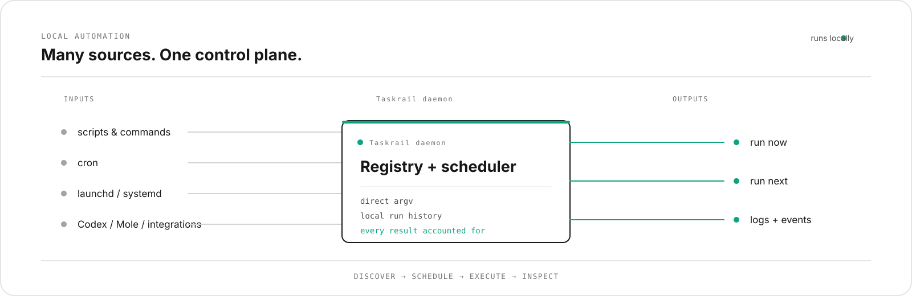

<div align="center">
  

  <p>
    <a href="https://github.com/Yuxin-Qiao/Taskrail/actions/workflows/ci.yml"></a>
    <a href="https://www.rust-lang.org/"></a>
    <a href="LICENSE"></a>
  </p>

  <p><a href="#quick-start">Quick start</a> · <a href="docs/chatgpt.md">ChatGPT integration</a> · <a href="README.zh-CN.md">简体中文</a></p>

  <p><sub>Works with</sub> · <a href="https://github.com/tw93/Mole">Mole</a> · <a href="https://github.com/Homebrew/brew">Homebrew</a> · <a href="https://github.com/restic/restic">restic</a> · <a href="https://github.com/rclone/rclone">rclone</a></p>
</div>

<p align="center">
  <sub>discover</sub> &nbsp;→&nbsp; <sub>schedule</sub> &nbsp;→&nbsp; <sub>execute</sub> &nbsp;→&nbsp; <sub>inspect</sub>
</p>

## Supported targets

Official binaries and CI cover only these ARM64 targets:

- macOS Apple Silicon: `aarch64-apple-darwin`;
- Linux ARM64: `aarch64-unknown-linux-gnu`.

x86_64 and Windows are not supported release targets. The Rust crate fails
closed when compiled for another target instead of producing an untested
binary. Source builds on other architectures are intentionally unsupported.

## Quick start

Install the binary from a checkout:

```bash
cargo install --path crates/taskrail
```

Add a command without writing a configuration file:

```bash
taskrail add hello /bin/echo --arg "hello from Taskrail"
taskrail list
taskrail run hello
taskrail runs
taskrail logs <run-id>
# Delete only a managed definition with no recorded run history
taskrail delete hello
```

The short path is:

```text
add → run → inspect
```

Add a recurring task:

```bash
taskrail add mole-cleanup mo --arg clean \
  --every-seconds 604800 --name "Mole cleanup"
```

Keep the scheduler running with the per-user service for your platform:

```bash
taskrail daemon --install
taskrail status
```

On macOS this installs a LaunchAgent. On Linux this installs a systemd user
unit under `~/.config/systemd/user/`. The Registry is stored under
`$XDG_DATA_HOME/taskrail/` (or `~/.local/share/taskrail/`) on Linux; the Unix
daemon socket uses `$XDG_RUNTIME_DIR/taskrail/` when available. For a headless Linux host,
enable user lingering before installing:

```bash
loginctl enable-linger "$USER"
taskrail daemon --install
```

The daemon performs a read-only native scheduler inventory refresh every five
minutes by default. Use `--discovery-interval-seconds` to adjust it. Status and
overview report the last scan, provider completeness, drift, and confirmed
missing-source counts; an unavailable provider is not treated as an empty
provider, so Taskrail does not manufacture deletion alerts.

## ChatGPT Scheduled tasks

Taskrail can be connected to ChatGPT as an MCP app with typed tools and optional
read-only MCP Apps widgets. ChatGPT Web, Desktop,
and Mobile use the same MCP tool contract; ChatGPT's Scheduled
page remains the natural-language scheduler and notification surface; Taskrail
is the local execution backend that ChatGPT calls on the selected ARM64 macOS
or Linux host.

Start the local MCP adapter after the Taskrail daemon is running:

```bash
taskrail daemon --install       # LaunchAgent/systemd by platform
taskrail mcp                    # MCP stdio adapter for the current host
taskrail integration chatgpt-doctor
```

The adapter exposes status, fresh native discovery, automation creation, pause and
resume, immediate runs, run history, logs, cancellation, attention items, and
audit events. The daemon also keeps a background read-only observation mirror;
status carries its safe supervision summary while overview still performs a
fresh scan. Commands remain direct argv; ChatGPT cannot turn a free-form string
into a shell pipeline through this interface.

For one private ARM64 macOS or Linux host, connect `taskrail mcp` through
OpenAI Secure MCP Tunnel, then add the tunnel as a ChatGPT developer-mode app.
For several hosts, use `taskrail mcp-fleet` with the local `examples/fleet.yaml`
shape and connect that one gateway. Copy the example outside the repository,
replace its endpoints and token environment-variable names, and enable only
the hosts you trust:

```bash
mkdir -p ~/.config/taskrail
cp examples/fleet.yaml ~/.config/taskrail/fleet.yaml
taskrail mcp-fleet --config ~/.config/taskrail/fleet.yaml
```

The checked-in example keeps its hosts disabled and uses placeholder endpoints;
it never makes an outbound request until you edit the local copy. Once the app
is connected, a Scheduled task can use prompts such as:

```text
Every Sunday at 09:00, run the Taskrail automation named "Mole cleanup" on this host.
If it fails, inspect the run logs and tell me what needs attention.
```

See [ChatGPT integration](docs/chatgpt.md) for the tunnel, permissions, and
multi-host setup details. With the fleet gateway, always name the target
`host_id` in a request; do not rely on a display label alone.

For a public deployment, use the enforced read-only HTTP profile:

```bash
export TASKRAIL_MCP_BEARER_TOKEN="<inject from a secret manager>"
taskrail mcp-http --profile public-read-only --bind 127.0.0.1:8787
```

This endpoint defaults to the public read-only profile and omits creation,
deletion, execution, adoption, and approval tools. Put it behind a production
HTTPS proxy with end-user authentication and per-user host binding; a local
tunnel is only a developer connection. See the [OpenAI submission checklist](docs/OPENAI_SUBMISSION.md)
and the [single-host deployment example](deploy/README.md).

For a private, single-host Fleet target that needs explicit write or run
requests, use `taskrail mcp-http --profile private` with a separate bearer
secret and private TLS/authentication edge. Never expose that profile as a
shared public relay; Fleet `allow_writes: true` is intended only for this
explicitly protected endpoint.

For a local stdio review of the public read-only profile, use:

```bash
TASKRAIL_MCP_PROFILE=public taskrail mcp
```

This profile omits creation, deletion, execution, adoption, and approval
tools.

Open the live terminal dashboard:

```bash
taskrail tui
```

The daemon is also the local web server for the primary browser dashboard. It
listens on `127.0.0.1:10100` by default; open it with:

```bash
taskrail gui
```

The dashboard shows discovery, automations, runs, logs, integrations, inbox,
approvals, metrics, and audit events. Its write actions call the same local RPC
and policy boundary as the CLI/TUI. It is loopback-only, requires a same-origin
browser request for writes, and is never exposed through the ChatGPT MCP or
Tunnel endpoint. Use `taskrail daemon --http-bind 127.0.0.1:10100` to choose a
different local port. If another local service owns `10100`, Taskrail falls
back to the next loopback ports and `taskrail gui` discovers the active
Taskrail endpoint instead of opening the other service.

The browser dashboard supports English, Simplified Chinese, Japanese, and
Korean. It selects a supported browser language on first load; use the language
selector in the top-right corner to change it. The selection is stored only in
the browser's local storage.

The ChatGPT MCP app can render the same bounded overview through a versioned
MCP Apps resource. The optional Fleet gateway also exposes a read-only
multi-host view; both widgets call typed MCP tools and never the local browser
HTTP endpoint.

For definitions that need more fields, use YAML:

```bash
taskrail register examples/hello.yaml
taskrail explain hello
taskrail run hello
```

The command executor uses direct argv. It does not turn a string into a shell
command.

## What it manages

Taskrail can manage commands and scripts you already use:

- one-shot commands and recurring interval or cron jobs;
- local run history, stdout, stderr, and operational events;
- launchd, cron, systemd user services, and Homebrew service discovery;
- explicit adoption of supported user-native jobs, with rollback records;
- deletion of unused managed definitions without deleting immutable run history;
- optional Codex and Responses-compatible AI executions;
- typed semantic integrations for Mole, restic, rclone, GitHub, Homebrew, mas,
  OSV-Scanner, Gitleaks, Trivy, and Topgrade;
- durable, typed integration Automations for read-only and dry-run schedules;
- normalized findings, metrics, changes, artifacts, run history, and inbox
  attention items from those integrations.

Native jobs are observed before Taskrail is asked to adopt them. Discovery does
not change the machine. Adoption is currently limited to supported user-level
sources and always requires an explicit command.

## Native integrations

Taskrail exposes one typed semantic layer for native tools. For example:

```bash
taskrail integration mole detect
taskrail integration mole doctor
taskrail integration mole analyze
taskrail integration mole status
taskrail integration mole history --limit 20
taskrail integration mole clean --dry-run
taskrail integration restic snapshots
taskrail integration rclone sync ./data remote:backup --dry-run
taskrail integration github pulls Yuxin-Qiao/Taskrail
taskrail integration homebrew outdated
taskrail integration gitleaks scan .
taskrail integration topgrade plan

# Persist a read-only native integration as a recurring Automation
taskrail schedule-integration homebrew-outdated homebrew outdated \
  --every-seconds 86400 --name "Daily Homebrew inventory"
```

These actions use typed argv plans, bounded parsing, normalized semantic
results, Run/Event/Metric records, and adapter verification. Writes and
destructive actions are bound to a persisted, expiring approval request:

```bash
taskrail approval-request restic-prune
taskrail approvals
taskrail approval-decide <approval-id> --approve
taskrail approval-execute <approval-id>
```

The exact typed approval request subcommands are shown by
`taskrail approval-request --help`. A granted request is one-time and matched
to the exact typed plan fingerprint. Without that approval, the existing
policy boundary records the request and does not spawn a process. Use
`taskrail integrations` to inspect the complete built-in adapter catalog.

## The TUI is the main view

The TUI is designed for a small, always-available local tool rather than a
browser dashboard. It shows each automation's name, ownership, runtime state,
next run, and attention items. Runs, logs, events, and metrics remain available
from the CLI.

```text
NAME              OWNERSHIP   STATE       NEXT RUN
Mole cleanup      managed     enabled     2026-08-18T...
GitHub watch      observed    paused      manual

Needs attention
failed run        run_failure  high
```

## AI is an executor, not the product

Simple work should remain a command:

```text
every Sunday → mo clean
```

An AI executor is useful when the task needs interpretation:

```text
every two hours → inspect GitHub state → summarize what needs attention
```

The current repository includes optional Codex CLI and Responses-compatible
executors. ChatGPT is the natural-language control surface: its Scheduled tasks
call the Taskrail MCP adapter, while Taskrail owns local discovery, typed
Automation definitions, execution, approvals, history, and logs. ChatGPT's
Scheduled task and Taskrail's local schedule are intentionally separate layers;
the former wakes the connected app, and the latter runs a persisted local
Automation.

For Codex installations with a model catalog generated by another tool,
Taskrail automatically uses a short-lived 0600 compatibility copy when the
known unsupported `audio` modality is present. The global Codex configuration
is not changed. An explicit catalog override is also available:

```bash
taskrail codex-run --cwd . --model-catalog-json /path/to/catalog.json \
  --prompt "inspect the repository"
```

## Local-first behavior

- The Registry is local SQLite.
- Runs, logs, and events are recorded locally.
- Commands are executed as argv; arbitrary shell strings are not accepted.
- Environment values are redacted in persisted automation snapshots.
- Existing native jobs remain observation-only until explicit adoption.
- The daemon refreshes native observations in the background and marks drift or
  confirmed missing sources as attention items; it never deletes a source from
  the Registry because a provider was unavailable.
- The ChatGPT MCP adapter reaches the daemon through the restricted local Unix
  socket; it does not expose the Registry directly.
- Approval requests are persisted locally, expire, are plan-bound, and are
  consumed once. They never contain secret values.

## Current status

The current package is `0.1.6` and is usable for local command automation and
private ChatGPT Scheduled-task control. The stable center is:

```text
add/register → list → daemon → run → history/logs → tui
```

The current implementation and remaining release gates are:

| Area | Status |
| --- | --- |
| Registry, scheduler, runs, logs, events | 🟢 Core |
| CLI and TUI | 🟢 Core |
| launchd / cron / systemd / Homebrew discovery and background supervision | 🔵 Integration |
| User-level native adoption | 🔵 Integration (cron/launchd/systemd) |
| Codex CLI and Responses executor | 🟣 Optional integration |
| Native semantic integrations | 🟢 Mole / restic / rclone / GitHub / Homebrew / mas / security scanners / Topgrade |
| Private ChatGPT MCP/Tunnel and Scheduled-task control | 🟡 Runtime recheck pending |
| Read-only ChatGPT MCP Apps views for local and Fleet overviews | 🟢 Implemented (private MCP) |
| Multi-host fleet gateway with explicit host routing | 🟢 Implemented (private configuration) |
| Public ChatGPT App hosting, review, and publication | 🟡 External gate |
| ARM64 CLI releases | 🟢 [v0.1.6 published](https://github.com/Yuxin-Qiao/Taskrail/releases/tag/v0.1.6) |
| Homebrew formula | 🟡 Future |

## Documentation

- [简体中文 README](README.zh-CN.md)
- [中文文档索引](docs/README.zh-CN.md)
- [Contributing](CONTRIBUTING.md)
- [Security](SECURITY.md)
- [ChatGPT integration](docs/chatgpt.md)
- [中文 ChatGPT 集成指南](docs/chatgpt.zh-CN.md)
- [Acceptance checklist](docs/ACCEPTANCE.md)
- [Architecture decisions](docs/adr/)
- [Research notes](deep-research-report.md)
- [Example automation](examples/hello.yaml)

The ADRs preserve historical decisions. They are not required to use the core
CLI and TUI.

## Contributing

Start with the core user journey and keep integrations at the edge. Before
opening a change, run:

```bash
cargo fmt --all -- --check
cargo +1.88.0 clippy --locked --workspace --all-targets --all-features -- -D warnings
cargo +1.88.0 test --locked --workspace --all-features
```

## License

Apache-2.0. See [LICENSE](LICENSE).
